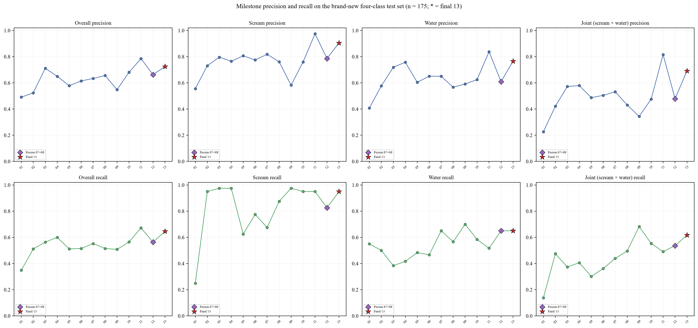

# CNN Model Evolution for Drowning-Acoustic Detection: Milestone Analysis

## 1. Background and alarm rule

The system raises a drowning alert only when a scream and a water splash are detected jointly in an audio window. This "AND" logic determines two features of the evaluation metrics: a missed alarm equals a missed detection of either class, so the joint recall (scream recall x water recall) is the core metric, while the joint false-alarm rate is the product of the two per-class false-positive rates and is usually near zero. All models are four-class CNNs (normal_speech / scream / water_splash / other_non_scream) with 128x128 log-mel spectrogram inputs at a 16 kHz sampling rate.

## 2. Changes in the expected metrics

As the application premise was clarified, the expected metrics changed in four layers: initially accuracy and macro-F1; after scream misses were found, scream recall and F1; after the co-occurrence alarm rule was confirmed, joint recall; finally a probe false-alarm constraint was added to form a fixed operating point. Three fixed benchmarks were established: the old v2.1 test set (654 clips), 58 real FSD50K water clips, and - critically - a brand-new four-class test set of 175 FSD50K eval clips unseen by any model. Because the old test set's water class was only ESC-50 approximations, it hid the real generalization gap; the new test set directly changed the model-selection conclusion.

## 3. Milestone parameter and performance evolution

The table below lists the 13 milestone versions in chronological order. Each parameter change was a response to a measured failure: 02 widened the encoder and added scream data after 01 missed most screams; 03 tempered the objective after 02 over-flagged; 11 cleaned the data and moved to width 48 to pursue single-label overall quality; 07 added 89 real FSD50K water clips after the ESC-50 approximation hid poor water generalization; 08 added 55 fresh dev screams after the fresh test exposed weak scream recall; 09 tested a pure dual-recall objective; and 10 extended training from 40 to 80 epochs.

| Version | Key change | width | dropout | objective | Fresh acc | macro-P / macro-R | scream P/R | water P/R | joint R | probe FP |
|---|---|---:|---:|---|---:|---:|---:|---:|---:|---:|
| **01** | Initial baseline: lightweight CNN, 4450 clips, severely imbalanced | 16 | 0.25 | macro-F1 | 0.457 | 0.564/0.443 | 0.62/0.25 | 0.46/0.58 | 0.146 | 0.063 |
| **02** | V2 architecture + FSD50K screams, GPU | 32 | 0.30 | scream-F1 | 0.600 | 0.620/0.609 | 0.78/0.95 | 0.65/0.52 | 0.491 | 0.294 |
| **03** | Tempering: macro-F1, stronger regularization | 32 | 0.40 | macro-F1 | 0.651 | 0.758/0.679 | 0.85/0.97 | 0.81/0.42 | 0.406 | 0.201 |
| **04** | Re-balanced dataset | 48 | 0.35 | accuracy | 0.674 | 0.745/0.701 | 0.85/0.97 | 0.87/0.45 | 0.439 | 0.228 |
| **05** | Aligned labels, balanced data | 48 | 0.50 | scream-F1 | 0.594 | 0.657/0.606 | 0.83/0.62 | 0.69/0.52 | 0.323 | 0.083 |
| **06** | Reference recipe + balanced data | 32 | 0.40 | macro-F1 | 0.611 | 0.703/0.626 | 0.86/0.78 | 0.72/0.48 | 0.375 | 0.099 |
| **07** | + 89 real FSD50K water clips | 48 | 0.50 | scream-F1 | 0.651 | 0.704/0.647 | 0.84/0.68 | 0.73/0.68 | 0.461 | 0.092 |
| **08** | + 55 fresh FSD50K dev screams (final) | 48 | 0.50 | scream-F1 | 0.646 | 0.710/0.652 | 0.83/0.88 | 0.67/0.60 | 0.525 | 0.135 |
| **09** | Dual-recall objective (min scream R, water R) | 48 | 0.50 | dual-recall | 0.651 | 0.670/0.638 | 0.64/0.97 | 0.68/0.73 | 0.715 | 0.383 |
| **10** | 08 recipe + 80 epochs | 48 | 0.50 | scream-F1 | 0.680 | 0.729/0.687 | 0.81/0.95 | 0.71/0.62 | 0.586 | 0.205 |
| **11** | Data cleaning + architecture-optimization retrain (late-stage) | 32 | 0.40 | macro-F1 | 0.743 | 0.823/0.766 | 0.97/0.95 | 0.89/0.55 | 0.522 | 0.063 |
| **12** | Probability fusion (0.5/0.5): water-strong + scream-strong | 48 | 0.50 | fusion | 0.686 | 0.732/0.686 | 0.85/0.82 | 0.71/0.68 | 0.564 | 0.109 |
| **13** | 11 fine-tuned on v3.6 with 1.5x water weight (final) | 32 | 0.40 | fine-tune | 0.754 | 0.801/0.761 | 0.95/0.95 | 0.85/0.68 | 0.649 | 0.109 |

### Dataset versions

The data behind these versions evolved in stages: the original four-class dataset used LibriSpeech dev-clean for normal speech, Kaggle human screams for scream/non-scream, and ESC-50 water approximations for water_splash (4450 training clips, severely imbalanced); v2 added FSD50K pure screams; the next stages expanded and cleaned the data (more water and hard-negative samples); the v3 stage re-balanced the classes to about 1200 per class and aligned the labels; v3.5 added 89 real FSD50K water clips to training and held out 58 real FSD50K water clips as an unseen test; v3.6 added 55 never-used FSD50K dev screams. Evaluation also uses a brand-new four-class test set of 175 FSD50K eval clips (scream 40 / speech 35 / water 60 / other 40) unseen by every version, and a 303-clip false-positive probe (birds, horns, children, alarms, pets, screech).

## 4. Changes in the training approach

The training objective went through four stages: accuracy (01, 04), scream-F1 (02, 05, 07, 08), dual-recall (09), and late-stage optimization (11 retrain, 13 water fine-tune). This mirrors the shift from "classify correctly on average" to "never miss the rare, safety-critical classes." Figure 1 shows precision (top) and recall (bottom) for overall, scream, water, and joint detection across the milestones.

**Figure 1.** Milestone precision (top) and recall (bottom) on the brand-new four-class test set (n = 175). 13 (11 water-optimized) is the final model.

## 5. Why 13 (11 water-optimized) is the final model

11 (data cleaning + architecture-optimization retrain) became the strongest overall four-class model in the late stage, but its water recall on the fresh test was only 0.550. 13 is 11 fine-tuned on the water-augmented v3.6 dataset (89 real FSD50K water clips) at a low learning rate with a 1.5x water-class weight: fresh water recall rises to 0.683 and the 58-clip real-water holdout recall to 0.724, while scream recall stays at 0.950 and accuracy rises to 0.754 (11: 0.743). The joint recall at threshold 0.4 reaches 0.665, the highest among precision-controlled versions, and the probe false-positive rate remains 0.109.

Compared with 11, 13 gains 13.3 points of fresh water recall and 8.6 points of real-water recall at almost no cost (scream recall unchanged at 0.950, accuracy +1.1 pt, macro precision/recall 0.801/0.761 vs 0.823/0.766, probe FP 0.109 vs 0.063). Compared with the fusion 12, 13 is a single checkpoint, simpler to deploy, with comparable joint recall at threshold 0.4 (0.665 vs 0.660) and higher scream precision (0.950 vs 0.846). 07 still leads the real-water holdout (0.776) and 09 pure joint recall (0.812 with FP 0.383), but 13 is the only single model simultaneously strong in scream, water, joint recall, and false-alarm control - the balance required by the joint drowning alarm.

11 looks stronger on the table because the macro metrics average the four classes equally, whereas the joint alarm does not: a missed water detection is the safety-critical half of the alarm, and 11's water recall of 0.55 means roughly half of the fresh water sounds are missed. 13 raises water recall to 0.683 (0.724 on the 58-clip real-water holdout) and the joint recall from 0.522 to 0.649 (0.665 at threshold 0.4), at the cost of some macro precision and a higher probe false-positive rate (0.063 to 0.109). For the drowning-alert application, this is the better trade.

| Metric | 11 | 13 | Better |
|---|---:|---:|---|
| Accuracy | 0.743 | 0.754 | 13 |
| Macro precision / recall | 0.823 / 0.766 | 0.801 / 0.761 | 11 |
| Scream precision / recall | 0.97 / 0.95 | 0.95 / 0.95 | 11 (precision) |
| Water precision / recall | 0.89 / 0.55 | 0.85 / 0.68 | 11 (precision) / 13 (recall) |
| Joint recall | 0.522 | 0.649 | 13 |
| Joint recall @0.4 | 0.554 | 0.665 | 13 |
| 58 real-water recall | 0.638 | 0.724 | 13 |
| Probe FP | 0.063 | 0.109 | 11 |

## 6. Future improvements

The remaining gaps are data, not architecture: more Splash_and_splatter samples for the water class, hard negatives for bird/pet/screech/siren false alarms, and a fixed 58-clip real-water holdout in every iteration. Next steps include per-class threshold calibration under a false-alarm constraint, a probability ensemble of 07 (water-strong) and 08 (scream-strong), and final validation on real DAS or field recordings.
